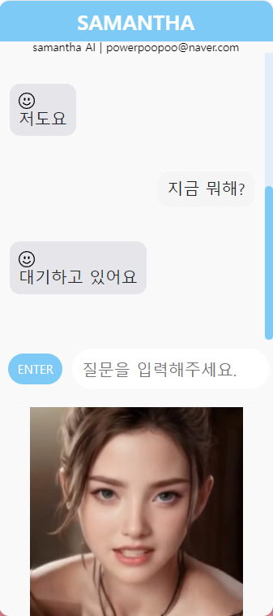

# Samantha V1

* Voice recognition is possible through the microphone.
* Samantha answers by text and voice.
* Samantha moves the look.
* There will be no more updates for this.

## Specifications
* Project Type: Maven
* OpenJDK: Temurin-11.0.22
* Server: Tomcat 9.0.54
* Framework: Spring Boot
* Database: PostgreSQL
* CI/CD: Jenkins

## You cannot use this source alone:
* Naver cloud service is paid and a security key is used.
* application.properties is controlled through the Jenkins library.
* So you won't find application.properties in my repository.

## ⭐ Still want to try it? ⭐
* Please contact us at any time through the contact information.

### 📞 Contact

* email: powerpoopoo@naver.com
* linkedin: https://www.linkedin.com/in/beemil
* github: https://github.com/Virtual-ChatBot
* youtube: https://www.youtube.com/@beemil
